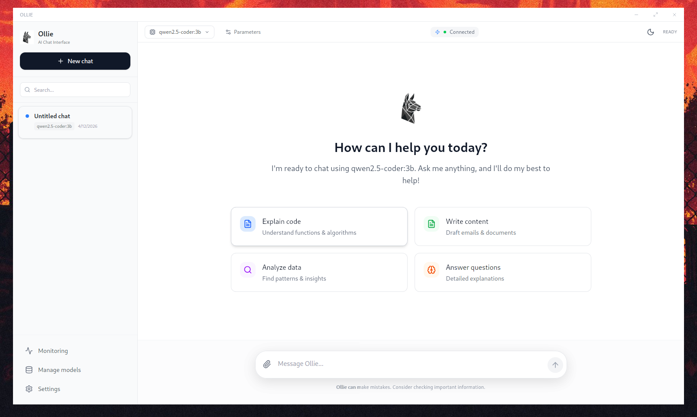
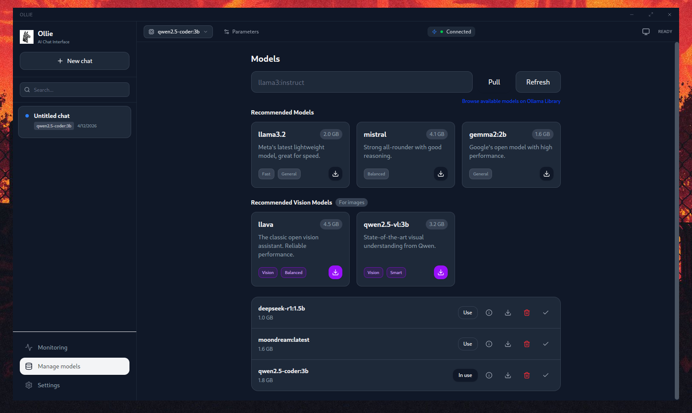
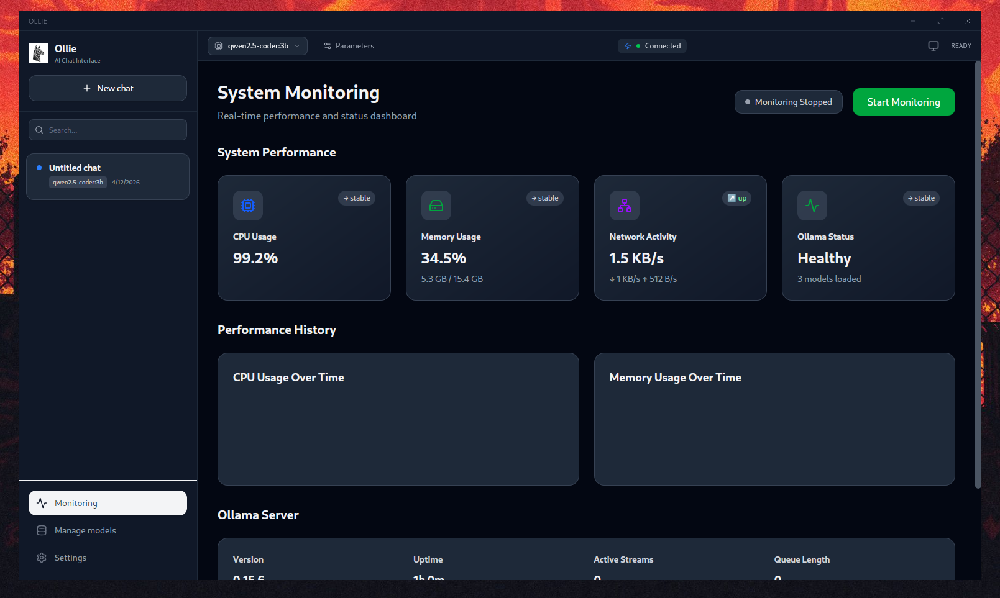

<div align="center">

<table>
  <tr>
    <td align="center" width="150">
      
    </td>
    <td align="center">
      
    </td>
  </tr>
</table>

<h3> Your Friendly Local AI Companion </h3>

</div>

**Ollie** (formerly OllamaGUI) is a personal AI assistant you run on your own Linux machine. It provides a polished, modern interface for chatting with local LLMs via Ollama—no CLI required.

If you want a personal, single-user assistant that feels premium, fast, and always-on, this is it.



## Install (Linux AppImage)

No configuration needed. Just download and run.

```bash
# Download the AppImage (v0.2.4)
wget https://github.com/MedGm/Ollie/releases/download/v0.2.4/Ollie_0.2.4_amd64.AppImage

# Make it executable
chmod +x Ollie_0.2.4_amd64.AppImage

# Run it
./Ollie_0.2.4_amd64.AppImage
```

*Requirements: [Ollama](https://ollama.com) installed and running.*

## Highlights

**Local-First Experience**
Ollie runs entirely on your machine. Your chats, data, and models stay private. No cloud dependencies, no tracking.

**Modern Chat Interface**
A clean, distraction-free UI built with React and Tailwind. Supports full Markdown rendering, code highlighting, tables, and math equations.

**Model Management**
Pull, delete, and manage your Ollama models directly from the app. No need to drop to the terminal.

**Vision & File Analysis**
Drag and drop images to analyze them with vision models like LLaVA. Upload PDFs and text files to chat with your documents instantly.

**Monitoring Dashboard**
Real-time tracking of system resources (CPU, Memory), running models with VRAM usage, and the ability to stop/unload models directly from the dashboard.

**Dark Theme**
Full dark mode with a light/dark/system toggle. System mode follows your OS preference automatically.

## Gallery

| Models | Settings |
|:---:|:---:|
|  |  |

| Monitoring | Vision |
|:---:|:---:|
|  |  |

## Tech Stack

- **Frontend**: React 19, TypeScript, Tailwind CSS v4
- **Backend**: Tauri v2 (Rust)
- **Database**: SQLite (local persistence)

## Data & Configuration

- **Local Database**: `~/.config/ollie/app.db`
- **Settings**: `~/.config/ollie/settings.json`

## Roadmap

### ✅ Recently Completed

- **Dark Theme**: Full dark mode with light/dark/system toggle, consistent across all screens. Contributed by [@leoniv](https://github.com/leoniv).
- **Monitoring Dashboard Enhancements**: View running models, VRAM usage, and stop/unload models directly from the Monitoring tab.
- **Model Download Progress**: Visual progress bars for model downloads with size/percentage display.
- **Fullscreen Code Preview**: Expand HTML/SVG previews to fullscreen modal for better viewing.
- **Streaming Performance**: Optimized first-token latency for faster response appearance.
- **Message Editing**: Edit sent messages and regenerate responses from any point.
- **Real-time HTML Preview**: Instant rendering of HTML/SVG artifacts directly in chat.
- **Think Mode**: Toggle visibility for reasoning models' thought processes.
- **Ollama Library Browser**: Browse available models directly from [ollama.com/library](https://ollama.com/library) in the pull dialog.
- **MCP Support**: Full Model Context Protocol integration for extensible tool access (filesystem, web, code execution, etc.).
- **Cloud API Support**: Unified provider system supporting OpenAI, Anthropic, Google Gemini, and GroqCloud alongside local Ollama models.
- **Startup Wizard**: Choosing between Local and Cloud modes.
- **Smart Streaming**: Throttled chunk batching for smooth UI even with ultra-fast cloud providers.
- **Graceful Error Handling**: Auto-fallback for models without tool support, truncation for large tool outputs.

### 🚀 Upcoming Features

**Quick Wins**
- **Export/Import Conversations**: Export chats as Markdown, JSON, or PDF. Import from ChatGPT/Claude formats.
- **Keyboard Shortcuts**: `Ctrl+N` new chat, `Ctrl+K` model switch, `Ctrl+/` focus input, and customizable keybindings.
- **Image/SVG Export**: Download HTML preview artifacts as PNG or SVG files.

**Core & Chat**
- **Structured Outputs**: Support for JSON schemas and advanced tool calling patterns.
- **Conversation Branching**: Fork conversations from any point.
- **Multi-Model Comparison**: Send same prompt to multiple models, compare responses side-by-side.
- **Prompt Templates Library**: Pre-built and user-created templates with variables.

**Developer Tools**
- **GitHub Integration**: Fetch repos for context, analyze PRs, export code to Gists.
- **RAG / Document Memory**: Index local folders, chat with your codebase using embeddings.
- **Local Code Sandbox**: Run Python/JavaScript code blocks in isolated environment with inline output.

**Agents & Models**
- **Agent Store**: One-click installation of prebuilt agents (coding, writing, etc.).
- **Model Factory**: Create and push custom Modelfiles directly from the UI.
- **Custom Agents**: Configure specific system prompts and behaviors per chat.

**Platform & Integration**
- **Ollama Server Discovery**: Auto-detect and connect to Ollama instances on local network.
- **Voice Mode**: Hands-free voice interaction.
- **Mobile Companion App**: iOS/Android versions.
- **Windows & MacOS Support**: Windows & MacOS versions.
- **Plugin System**: Extend functionality with community plugins.
- **Internationalization**: Multi-language UI support.

## Contributors

- [@MedGm](https://github.com/MedGm) — creator & maintainer
- [@leoniv](https://github.com/leoniv) — dark theme & UI polish

## License

MIT License. Created by @MedGm.
